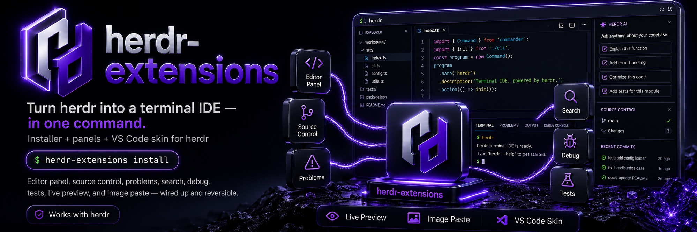

<p align="center">
  <picture>
    <source srcset="docs/assets/banner.webp" type="image/webp">
    
  </picture>
</p>

# herdr-extensions

Turn [herdr](https://herdr.dev) into a terminal IDE, in one command.

```
herdr-extensions install
```

That single command installs **everything** — the editor, `lazygit`, a Nerd Font, `prettier` — then
registers twelve panels, injects the keybindings, and checks them against herdr's own so nothing of
yours breaks. There is no second step and no companion package to go and fetch.

Inline diagnostics, a real editor panel, source control, search, problems, a debugger, a live
preview of your app, screenshot paste, and a VS Code skin — wired up, keybound, collision-checked,
and completely reversible.

## About

[herdr](https://herdr.dev) is an agent multiplexer: workspaces, tabs and panes for running coding
agents in a terminal, with a session that survives a dropped SSH connection. It has a plugin system
but no editor, no source-control UI, and no diagnostics.

**herdr-extensions is the IDE half.** It turns a herdr session into something shaped like VS Code —
file tree and editor on the left, agent on the right, twelve panels a keypress away — while staying a
terminal, so the whole thing still works over SSH and survives a disconnect.

### Who it is for

Anyone who runs a coding agent in a terminal and misses the parts of an IDE that make a codebase
navigable: seeing the tree, jumping to a definition, reading diagnostics inline, glancing at a diff,
looking at the app you are building. Especially over SSH, where a GUI editor is not an option.

### What it is not

It is an **installer**, not a framework. There is no plugin manager, no extension marketplace, no
config DSL. It writes a herdr plugin manifest, a handful of scripts, and a marker-delimited block of
keybindings — then gets out of the way. `uninstall` restores your `config.toml` byte-for-byte.

### What you get on screen

One command turns a bare herdr pane into this:

```
┌─ herdr ────────────────────────────────────────────────────────────────────┐
│ ┌─ Edit ───────────────────┐ ┌─ agent ────────────────────────────────────┐│
│ │ EXPLORER                 │ │                                            ││
│ │ my-project               │ │  > add a health check endpoint             ││
│ │ ▾  src/                  │ │                                            ││
│ │   ▸  api/                │ │  I'll add it to src/api/routes.ts and      ││
│ │      routes.ts    M      │ │  wire up a test…                           ││
│ │      server.ts           │ │                                            ││
│ │ ▸  tests/                │ │                                            ││
│ │    package.json          │ │                                            ││
│ │                          │ │                                            ││
│ │  12  export function …   │ │                                            ││
│ │  13    ~~~~~~~~~~~~      │ │                                            ││
│ │      ↑ inline diagnostic │ │                                            ││
│ └──────────────────────────┘ └────────────────────────────────────────────┘│
│ ┌─ Problems ─────────────────────────────────────────────────────────────┐ │
│ │ src/api/routes.ts:13  error  Property 'healthz' does not exist         │ │
│ └────────────────────────────────────────────────────────────────────────┘ │
└────────────────────────────────────────────────────────────────────────────┘
   ctrl+b shift+e  editor      ctrl+b shift+m  problems    ctrl+b shift+a  preview
```

Editor left, agent right, panels a keypress away — all inside one terminal, so it works over SSH and
survives a disconnect.

### How it fits together

You install one thing. It brings the rest:

```
                    herdr-extensions install
                              │
      ┌───────────────────────┼───────────────────────┐
      │                       │                       │
      ▼                       ▼                       ▼
 registers a           installs the            injects 15
 herdr plugin          dependencies            keybindings
 (12 panels)           you don't have          (collision-checked
      │                       │                 against herdr's 39)
      │                       ├─ herdr-edit ── the editor + LSP
      │                       ├─ lazygit ───── source control
      │                       ├─ Nerd Font ─── file icons
      │                       └─ prettier ──── format on save
      ▼
 ┌──────────────────────────────────────────────────────────────┐
 │ herdr        workspaces · tabs · panes · session over SSH    │
 └──────────────────────────────────────────────────────────────┘
```

**The editor is not a separate step.** `install` runs
`brew install vonzelle-vzt/herdr-edit/herdr-edit` for you when it is missing, so
[herdr-edit](https://github.com/vonzelle-vzt/herdr-edit) arrives as part of this package. You only
need to know it exists if you want to work on the editor itself — or if you would rather keep upstream
[SpiceEdit](https://github.com/cloudmanic/spice-edit), which is also supported (you lose diagnostics;
everything else behaves the same).

Layers, and who owns what:

| Layer | Owns | Provided by |
| --- | --- | --- |
| Session | workspaces, tabs, panes, survives SSH drop | **herdr** (third-party, unpatched) |
| IDE | 12 panels, layout, keybindings, skin, installer | **this repo** (original work) |
| Editing | buffer, rendering, LSP, word wrap, file tree | **herdr-edit** (installed for you) |
| Tools | git UI, search, typecheck, lint, tests, preview | lazygit, ripgrep, tsc, eslint, ruff, vitest, Chrome |

Nothing here patches herdr. Everything lands as a plugin manifest plus a marker-delimited block of
keybindings, which is why `uninstall` can restore your config byte-for-byte.

### Where this sits

The obvious neighbours, on the axes that actually differ. Checked 2026-07-30; Orca figures come from
its public repo (33.1k stars, TypeScript, `monaco-setup.ts`).

| | VS Code | herdr alone | Orca | **herdr + this** |
| --- | --- | --- | --- | --- |
| Runs in a terminal | ✗ GUI app | ✓ | ✗ Electron desktop | ✓ |
| Usable over plain SSH | Remote-SSH, GUI client still needed | ✓ | ✗ | ✓ |
| Survives a dropped connection | ✗ | ✓ session persists | ✗ | ✓ |
| Editor included | ✓ | ✗ none | ✓ Monaco | ✓ installed for you |
| Diagnostics across languages | ✓ full LSP | ✗ | TypeScript only, via Monaco's bundled worker — no LSP client | ✓ real LSP (`gopls`, `rust-analyzer`, …) |
| Runs a fleet of coding agents | ✗ | ✓ | ✓ | ✓ (herdr's job) |
| Live preview of your app | extension | ✗ | ✓ | ✓ built in |
| Paste a screenshot to the agent | n/a | `--remote` only | ✓ | ✓ local |
| Source | open, MIT-ish core | source-available | **no licence file** | **MIT** |
| Cost | free | free | paid tiers | free |

Read it as positioning, not a takedown. VS Code is a better GUI IDE and always will be — it is not
trying to survive an SSH drop. Orca is solving a genuinely different problem, an agent fleet on the
desktop, and solving it well; its 33k stars are earned. herdr alone is deliberately not an IDE.

What is actually unclaimed ground is the intersection: **an IDE that lives in a terminal, keeps real
language intelligence, and comes back after your connection dies.**

That claim is worth stating precisely, because it is the whole reason this exists. Across the
marketplace's **417 plugins** — swept by topic and by keyword for `lsp`, `language server`,
`autocomplete`, `refactor`, `formatter`, `symbol`, `outline`, `lint`, `blame`, `intellisense` and
`go to definition` — exactly **two** repos surface any of it. This one, natively. And
[herdr-fresh](https://github.com/rvalledorjr/herdr-fresh) (1★), which is a thin launcher for
[Fresh](https://getfresh.dev), a separate third-party terminal IDE that brings its own.

So: no other plugin *implements* language intelligence, and one wraps an editor that has it. That
is the gap a competitor cannot close with a shell wrapper, because it needs a live process that has
parsed your project.

Ideas were taken freely from all three — the panel layout is VS Code's, the agent-pane model is
herdr's, and the ambition of an IDE built around agents is Orca's. **No code was.** There is no
Monaco, no Electron, and no Orca-derived source anywhere in this repo or in herdr-edit; the only
inherited code is spice-edit's, which is MIT and credited in
[herdr-edit](https://github.com/vonzelle-vzt/herdr-edit).

### Against the other plugins in herdr's own marketplace

The neighbours above are different products. These are direct: the plugins that also try to make
herdr feel like an IDE. Star counts and features checked 2026-07-30.

| | [file-viewer](https://github.com/smarzban/herdr-file-viewer) 290★ | [reviewr](https://github.com/persiyanov/herdr-reviewr) 283★ | [sidebar](https://github.com/alexarthurs/herdr-sidebar) | [browser](https://github.com/ogulcancelik/herdr-browser) 190★ | **this + herdr-edit** |
| --- | --- | --- | --- | --- | --- |
| File tree | ✓ | ✓ | ✓ | — | ✓ |
| Syntax highlighting | ✓ via `bat` | ✓ | ✓ | — | ✓ Chroma, in-process |
| **Edit files** | ✗ read-only | ✗ read-only | ✗ read-only | — | ✓ **a real editor** |
| **LSP / diagnostics** | ✗ | ✗ | ✗ | ✗ | ✓ **9 server families** |
| **Hover · go-to-definition** | ✗ | ✗ | ✗ | ✗ | ✓ |
| Find in file | ✗ | ✓ | ✗ | — | ✓ |
| **Find and replace** | ✗ | ✗ | ✗ | — | ✓ regex · whole-word · case |
| Repo search | fuzzy names | ✓ names + grep | ✗ | — | ✓ ripgrep panel |
| Git status in the tree | ✓ | ✓ | ✓ | — | ✓ |
| Diff view | ✓ auto per file | ✓ + line comments | ✓ | — | ⏳ gutter marks + hunk preview only |
| Stage / commit | ✗ | ✗ | ✓ + AI messages | — | ✓ via lazygit |
| **Comment on a diff → send to the agent** | ✗ | ✓ | ✗ | — | ✓ Review panel |
| PR view | ✗ | ✓ | ✗ | — | ✗ (other plugins do this well) |
| **Typecheck / lint problems** | ✗ | ✗ | ✗ | ✗ | ✓ tsc · eslint · ruff |
| **Runtime errors from the running app** | ✗ | ✗ | ✗ | console only | ✓ into the Problems panel |
| **Run tests** | ✗ | ✗ | ✗ | ✗ | ✓ vitest · jest · pytest |
| **Debug configs** | ✗ | ✗ | ✗ | ✗ | ✓ reads `launch.json` |
| **Live preview of your app** | ✗ | ✗ | ✗ | ✓ full Chromium/CDP | ✓ screenshot, auto-refresh |
| Markdown preview | ✓ | ✓ | ✗ | — | ✓ |
| **Paste a screenshot to the agent** | ✗ | ✗ | ✗ | ✗ | ✓ |
| Installs its own dependencies | ✗ | ✗ | offers a font | — | ✓ editor, lazygit, font, prettier |
| Checks your keybindings for clashes | ✗ | ✗ | ✗ | ✗ | ✓ against herdr's 39, at runtime |

**What that table says.** The marketplace is full of excellent *viewers* — file-viewer and reviewr
still read a diff better than we do, and that is worth saying plainly. Roughly **eight** plugins
implement the comment-back-to-the-agent loop, which makes it the most-replicated idea in the
ecosystem; the Review panel closes it here, and a real diff view is still owed.

But every one of them is read-only, and none implements language intelligence. Nobody else here is
an editor that can tell you an identifier does not exist without you running a build, and nobody
else runs your typechecker, your tests, your debugger and a picture of your app from the same
keymap.

Read the split this way: **the editor-primitive half of the space is uncontested and we own it; the
agent-workflow half is where the ecosystem has converged and where every one of our real gaps
sits.**

Where a neighbour is clearly better, the honest answer is to use it: reviewr for a careful diff
read, herdr-browser when you need to *click* the page rather than look at it. They compose — that is
what a pane multiplexer is for. The two gaps we intend to close ourselves are marked ⏳ above, and
they are tracked in [What it doesn't do](#what-it-doesnt-do).

## Why one command matters

The most common reason people abandon a terminal setup is not a missing feature. It is waking up to
a config that broke overnight — a plugin renamed a module, an update moved a keybinding, and half
an hour disappears before any work starts.

So this is an **installer**, not a framework. It is idempotent (run it twice, the second run reports
zero changes), it is reversible (uninstall restores your `config.toml` byte-for-byte), it never
rewrites your config wholesale (everything lands between managed markers), and when something is
wrong `herdr-extensions doctor` tells you *which* thing and *why*. There is no plugin manager to
break, because there are no plugins.

## What you get

| Key | Panel |
| --- | --- |
| `ctrl+b` `shift+e` | Editor panel, **left** of your agent pane. Press again to close. |
| `ctrl+b` `shift+o` | Editor full-width in its own tab. |
| `ctrl+b` `shift+s` | lazygit source control, below. |
| `ctrl+b` `shift+m` | Problems — `tsc --noEmit`, `eslint`, `ruff`. |
| `ctrl+b` `shift+f` | Search — ripgrep across the repo. |
| `ctrl+b` `d` | Debug — your `.vscode/launch.json`, handed to an installed adapter. |
| `ctrl+b` `t` | TODO / FIXME / HACK / XXX. |
| `ctrl+b` `shift+b` | Blame and history for the file you are looking at. |
| `ctrl+b` `shift+v` | Markdown preview. |
| `ctrl+b` `shift+u` | Tests — vitest / jest / pytest. |
| `ctrl+b` `shift+a` | **Preview** — the dev server rendered inside a pane, refreshing itself. |
| `ctrl+b` `shift+k` | **Review** — read the agent's diff, cite lines, send your notes back to it. |
| `ctrl+b` `shift+i` | **Image watcher** — drop an image on your Desktop and it goes to the agent. |
| `ctrl+b` `i` | **Paste an image** — clipboard screenshot, or the newest capture, typed as a path to the agent. |
| `ctrl+b` `shift+l` / `shift+h` | Nudge the split divider right / left. |

Plus a VS Code skin for herdr itself:

```
herdr-extensions skin vscode-dark-modern    # or vscode-light, or reset
```

Open a project and the editor appears on its own, already scoped to that repo.

## About those keys

herdr reserves **39** prefix bindings, and a `[[keys.command]]` entry silently overrides a built-in
— no warning, no log line, the built-in just stops working and herdr gets the blame. v0.1.0 of this
package shipped `prefix+e`, `prefix+g` and `prefix+r` and so destroyed `edit_scrollback`, `goto`
(the fuzzy space/tab/agent picker) and `resize_mode` on every machine that installed it.

That is fixed, and it will not happen again: the reserved set is re-derived from
`herdr --default-config` **at runtime** rather than hardcoded, `install` refuses on a conflict, and
`doctor --keymap` audits your own bindings too — they can break herdr just as easily as ours can.

## The panels

Each is a herdr pane. They follow the file you have open, via a small snapshot the editor publishes
to `$XDG_STATE_HOME/spiceedit/active.json` — and each degrades to the repo root, saying so, when
that is absent.

| Panel | What it runs |
| --- | --- |
| **Problems** | `tsc --noEmit`, `eslint --format json`, `ruff check` — whichever the repo has. Resolves them from `node_modules/.bin` first, so the repo's pinned version wins. **Also reports runtime errors**: `console.error` output and uncaught exceptions thrown by the app the Preview panel is driving, mapped back to `file:line`. Static analysis tells you what is wrong with the source; this tells you what actually broke. |
| **Search** | `ripgrep` across the repo root, grouped by file. 5–10× faster than a GUI search, and it respects `.gitignore` for free. |
| **TODO** | `TODO` / `FIXME` / `HACK` / `XXX` with file and line. |
| **Blame** | `git log --follow` and `git show --stat` for the file you are looking at. |
| **Debug** | Parses the repo's `.vscode/launch.json` — comments and trailing commas included, because it is JSONC — lists the configurations, and hands off to an installed adapter (`koan-debugger`, `debugger-cli`, `dlv`, `lldb-dap`, `tdb`). |
| **Markdown** | `glow -s dark` on the active file. |
| **Tests** | Detects vitest / jest / pytest from `package.json` or `pyproject.toml`. |
| **Images** | Watches your screenshot folder, `~/Desktop` and `~/Downloads`, and types each new image's path to the agent pane. herdr **cannot take a Finder drag-and-drop locally** — its own config documents `remote_image_paste` as *"only active in herdr --remote"* — so rather than leave you without a way to show the agent a picture, this inverts the problem: dragging the image to your Desktop becomes dragging it into the conversation. |
| **Review** | The agent's diff against your branch's merge-base, with line numbers. Type `path:line your note`, collect as many as you like, and one key sends them all back to the **agent pane** as a single message. Or type `e path:line` and **open that line in the editor to fix it yourself** (or open the diff in the editor with `ctrl+b shift+e` then `Esc o`, and press `Esc e` on any line to jump to it — cursor selection rather than typing a reference) — every other review plugin in the marketplace is read-only, so being able to edit from the review is the part nobody else has. And `p` pushes the branch and opens a **draft** pull request with your notes as the body, which is the third verb of the loop: fix it, hand it back to the agent, or send it out to a human. |
| **Git** | `lazygit`. Interactive staging alone is worth the panel — plus an **AI commit message** command that drafts a subject line from the staged diff with your local `claude` CLI. |

Every command they run is resolved to an **absolute path**, because the herdr server runs under
launchd with `PATH=/usr/bin:/bin:/usr/sbin:/sbin` and a bare binary name fails to spawn with no
useful error. Worth knowing: on many machines `rg` is a *shell function*, so anything that `execve`s
it fails even though `rg` works fine when you type it.

## Seeing what you are building

`ctrl+b` `shift+a` opens a **Preview** panel: your dev server, rendered as an image inside a herdr
pane, refreshing every few seconds. It is the terminal equivalent of VS Code's Live Preview.

A terminal cannot display a web page on its own. Three approaches exist and only one is worth having:
a text-mode browser (`w3m`, `lynx`) throws away CSS and layout, so it tells you nothing about a UI;
`carbonyl`/`browsh` embed a real engine but are a heavyweight extra dependency; and headless Chrome
plus an inline image protocol gives you actual pixels using two things you already have. So the panel
screenshots the page with Chrome and draws it with `chafa` — real rendering, real layout, in a pane.

It finds the server by probing what is **listening** (3000, 3001, 5173, 5174, 4321, 8080, 8000, 4200,
1313) rather than reading `package.json`, because a `--port` flag is frequently overridden and a
listening socket is ground truth where a config file is only an intention. Override with
`HERDR_PREVIEW_URL`, the port list with `HERDR_PREVIEW_PORTS`, the cadence with
`HERDR_PREVIEW_INTERVAL`.

In the panel: `r` refresh, `o` open the page in your real browser (full fidelity and actually
clickable — the preview is a picture), `q` close.

**Requirements.** Chrome or Chromium, `chafa` (`brew install chafa`), and a terminal that implements
an inline image protocol. 🔴 **Apple Terminal implements none, ever** — the panel says so rather than
drawing mush. Ghostty, kitty and WezTerm all work; herdr needs `kitty_graphics = true`.

## Images and screenshots in a terminal chat

Terminals carry text, not image bytes, so there is no way to paste a PNG into a pane. But agents read
image **paths** natively — so the problem reduces to getting a path onto the prompt line, which is
plain text and works fully locally. herdr's own image paste is `--remote` only because it tries to
bridge the clipboard itself; this needs none of that.

`ctrl+b` `i` stages an image and types its path into the agent pane, **without** pressing Enter, so you
add your question before submitting:

1. an image on the clipboard (`Cmd+Ctrl+Shift+4`, or any *Copy Image*) — needs `pngpaste`;
2. otherwise the newest screenshot, read from your **actual** `com.apple.screencapture location`
   rather than a hardcoded `~/Desktop`;
3. `image-paste.sh <file>` for an explicit file.

**Drag and drop works, and it bypasses this package entirely** — verified in Ghostty: dropping an
image on the prompt hands it to the agent directly, and the agent caches the file itself. Prefer it
when you have a file on disk, because it is the *higher fidelity* route: the dropped file arrives
byte-for-byte (measured: 20,501 bytes in, 20,501 bytes cached), whereas the clipboard round-trip
re-encodes the PNG on the way through (the same image came out at 28,377 bytes).

So the two paths are complementary rather than redundant:

| | use it for | fidelity |
| --- | --- | --- |
| **drag & drop** | a file you already have | original bytes, handled by the agent |
| **`ctrl+b` `i`** | a screenshot you just took, still on the clipboard | re-encoded PNG, staged in `~/.vzt/shots` |

The clipboard is the case a terminal genuinely cannot do on its own, which is why it needs staging: you
cannot drop something that has never been a file.

It picks the pane carefully: focus is usually parked on one of our own panels — the editor auto-opens
focused — and a path typed into the file tree does nothing at all. So it targets the focused pane only
when that is not one of ours, then an agent in the same tab, then the same workspace, and only then
anywhere else. Dropping a path into a live session in an unrelated project is worse than doing nothing.

Staged clipboard images land in `~/.vzt/shots`; `image-paste.sh --prune [DAYS]` clears old ones and
`doctor` warns once there are more than 200.

## Guides

### First five minutes

```bash
herdr-extensions install     # installs deps, writes the plugin, injects keybindings
herdr-extensions doctor      # verifies every moving part and names any failure
herdr                        # start a session
```

Then `herdr workspace create --cwd ~/code/my-project --label "my project"` — or open a project any
way you like. The editor appears on its own, already scoped to the repo.

Set your terminal font to a Nerd Font first (see [File icons](#file-icons-need-one-manual-step)) or
the file tree shows boxes. Ghostty is the recommended host: it is the only one of the common macOS
terminals that does inline images, OSC 52 clipboard, *and* Nerd Fonts.

### Day-to-day: reading a codebase

| Want | Do |
| --- | --- |
| See the tree | it is already there — the editor auto-opens per project |
| Jump to a definition | `Esc d` in the editor |
| What is this symbol? | `Esc h` |
| Find a file | `Esc p` |
| Find in this file | `Esc f` |
| Search the repo | `ctrl+b` `shift+f` |
| What is broken? | `ctrl+b` `shift+m` |
| Who wrote this line? | `ctrl+b` `shift+b` |
| Long lines running off? | `Esc z` toggles word wrap |

### Day-to-day: shipping

| Want | Do |
| --- | --- |
| Stage and commit | `ctrl+b` `shift+s` (lazygit — interactive staging alone is worth the panel) |
| Run the tests | `ctrl+b` `shift+u` |
| See the app | `ctrl+b` `shift+a` |
| Show the agent a screenshot | copy it, then `ctrl+b` `i` |
| Show the agent a file | drag it onto the prompt |
| More room for the editor | `ctrl+b` `shift+l` |

### Working with an agent

The two habits that matter most, because they are the ones a terminal normally makes hard:

**Show, don't describe.** `ctrl+b` `i` types the path of a clipboard image onto the prompt without
submitting, so you add your question after it. Screenshot a broken layout and ask about *that*
rather than writing a paragraph describing it.

**Keep the code visible.** The editor sits left of the agent, so you can read what it is changing
while it changes it. `ctrl+b` `shift+l` / `shift+h` shifts the balance when you need more of one.

### Uninstalling

```bash
herdr-extensions uninstall           # plugin + keybindings; your config.toml is restored exactly
herdr-extensions uninstall --purge   # also removes the editor configs it wrote
```

Nothing is left behind between the managed markers, and your own keys, comments and settings survive
both directions.

## Troubleshooting

Run `herdr-extensions doctor` first — it checks every moving part and names the specific failure.

**The file tree is full of `?` or empty boxes.** Your terminal's font has no Nerd Font glyphs. The
editor detects fonts on *disk*; it cannot know what your terminal renders with. On macOS `doctor`
decodes your Terminal.app profile and tells you which font it found. Either point that profile at a
Nerd Font, or use a terminal like Ghostty — which also gains you inline images and OSC 52 clipboard,
neither of which Apple Terminal supports at all.

**A herdr keybinding stopped working.** Run `herdr-extensions doctor --keymap`. A `[[keys.command]]`
entry silently overrides a herdr built-in, and herdr gets the blame. The audit covers your own
bindings too, not just ours.

**A pane will not resize.** `prefix+r` is the *only* resize binding herdr ships (`resize_mode`), so
anything bound to `prefix+r` removes pane resizing entirely — the symptom is a divider that seems
stuck rather than a missing keybinding. The `persiyanov.reviewr` plugin binds `prefix+r` by default;
move it to `prefix+shift+c`. `doctor --keymap` names this specific collision, and note that
`prefix+shift+r` is *also* reserved, so it is not the escape hatch it looks like.

**Dragging the divider with the mouse does nothing.** That is herdr, not this package: 0.7.5 has no
divider-drag action at all — its keybinding table contains `resize_mode` and nothing else for
resizing. `ctrl+b` `shift+l` / `shift+h` nudge the divider one step each, which is the closest
substitute available from outside herdr. (`mouse_capture = true` also forwards mouse events to any
pane app that requests them, so a drag starting *inside* a pane reaches that app rather than herdr.)

**The panel is too big, or says "Window too small — please resize".** These are the same problem.
`herdr plugin pane open` has no `--ratio`, so plugin panels open at a hard 50/50, while the editor
has a minimum width below which it refuses to draw. Panels are sized in columns here, clamped so
neither end is reachable. If you are on upstream `spiceedit`, install
[`herdr-edit`](https://github.com/vonzelle-vzt/herdr-edit) — its layout degrades instead of refusing.

**The editor panel opens but shows no file tree.** The panel is narrower than the editor's tree
threshold. Upstream `spiceedit` hides its tree below 76 columns, which switches the explorer off in
exactly the place it earns its keep — a split beside an agent, where the pane is 60-odd columns.
[`herdr-edit`](https://github.com/vonzelle-vzt/herdr-edit) narrows the tree toward 18 columns instead
and only hides it below 42. `./tests/live-check.sh` checks this directly (ORACLE 19) by reading the
pane rather than trusting its width.

**The editor opened in its own tab instead of beside my agent.** Your layout is under
`MIN_COLS + MIN_PEER` usable columns, so a side-by-side cannot give both panes a readable width. Note
that herdr's own sidebar can be 36 of them — `prefix+b` collapses it and usually resolves this
outright. Everything above that floor splits; if you see a tab above it, that is a bug.

**A project opened with no editor at all.** The workspace is rooted at `$HOME` (a plain
`herdr workspace create` with no `--cwd` does this) and its label matched no single repo under
`PROJECTS_ROOT`. Auto-open stays silent rather than rooting a file tree in your home directory. Give
the workspace a label matching the project directory, or create it with `--cwd`.

**No diagnostics.** They need a language server *and* `herdr-edit`. Upstream `spiceedit` has no LSP
client. `doctor` reports which editor it found.

**Every `herdr` command started failing after a `brew install`.** Homebrew may have upgraded herdr
underneath the running server, leaving the CLI a protocol version ahead of it. Check `herdr status`
for `compatible:`. The fix is a server restart — but that exits every pane process, so set
`[session] resume_agents_on_restore = true` **first** or you discard every agent conversation.

## What it actually does

herdr has a plugin system but no editor. [SpiceEdit](https://github.com/cloudmanic/spice-edit) is a
first-rate terminal editor with no plugin system *by design*. [lazygit](https://github.com/jesseduffield/lazygit)
is the git UI. Gluing the three together correctly takes about ten steps, several of which fail
**silently** when you get them wrong. This does them right:

- registers a herdr plugin providing the editor, git, and nine more panels
- renders every pane command to an **absolute path** (the herdr server runs under launchd's minimal
  `PATH`, so a bare `spiceedit` never spawns — and the right absolute path differs on Apple Silicon,
  Intel, and Linux)
- resolves the **project root** for each panel via `git rev-parse --show-toplevel`, so the tree shows
  your repo instead of ~80 dotfiles from `$HOME`
- puts the editor on the **left** (herdr can only split `right`/`down`, so it opens then swaps)
- installs `herdr-fmt`, a formatter resolver that makes format-on-save work in *every* repo
- injects keybindings between managed markers, so your own config survives install **and** uninstall
- sizes each panel in **columns**, not as a fraction — `herdr plugin pane open` has no `--ratio`, so
  every plugin panel otherwise opens at a hard 50/50, and the editor has a minimum width below which
  it refuses to draw at all
- decides split-vs-tab from the **floors** rather than the requested width, and lifts the editor to a
  width that can actually show a file tree whenever the split can host one beside a readable agent
- falls back to the **workspace label** to find your repo when the pane is rooted at `$HOME`, so a
  workspace called `affiliate crm` opens `affiliate-crm-fintech` instead of nothing at all

## Install

**Homebrew** — this repo is its own tap:

```bash
brew tap vonzelle-vzt/herdr-extensions https://github.com/vonzelle-vzt/herdr-extensions
brew trust vonzelle-vzt/herdr-extensions      # see below — recent Homebrew requires this
brew install vonzelle-vzt/herdr-extensions/herdr-extensions
herdr-extensions install
herdr-extensions doctor        # confirm every moving part
```

> **`brew trust` is not optional on current Homebrew.** Recent versions refuse to load a formula
> from any third-party tap that has not been explicitly trusted, failing with *"Refusing to load
> formula … from untrusted tap"*. That reads like the tap or the formula is broken, and it is
> neither — it is Homebrew declining to run code from a tap you have not vouched for, which is a
> reasonable default. The same applies to the editor's tap
> (`brew trust vonzelle-vzt/herdr-edit`). Trust it only because you have read what it installs.

**Without Homebrew** — clones to `~/.local/share/herdr-extensions` and links into `~/.local/bin`:

```bash
curl -fsSL https://raw.githubusercontent.com/vonzelle-vzt/herdr-extensions/main/install.sh | sh
herdr-extensions install
herdr-extensions doctor
```

`brew install` only puts the CLI in place. **`herdr-extensions install` is the step that does the
work**: it installs whatever is missing — the editor, `lazygit`, a Nerd Font, `prettier` — registers
the plugin, and injects the keybindings. Run it with `--no-deps` to manage the dependencies yourself.

Requires **herdr ≥ 0.7.0**. herdr is deliberately *not* a Homebrew dependency, because
`herdr-extensions doctor` reports a missing or too-old herdr far more usefully than brew's resolver
would.

<details>
<summary>Both paths are verified against a real install, not just documented</summary>

Every command above has been run end to end, because all three install paths were broken at once and
none of the breakage was reachable from a development checkout:

| Checked | Result |
| --- | --- |
| `brew audit --strict --online` | clean |
| `brew fetch` | tarball checksum verified |
| `brew install` | keg built; `bin/` → `Cellar/bin/` → `libexec/bin/` symlink chain resolves |
| `herdr-extensions install --dry-run` from the keg | exit 0 |
| `brew test` | passes |
| `curl … install.sh \| sh` | clones, links into `~/.local/bin`, exit 0 |

What was broken: the editor step tapped `cloudmanic/spice-edit` (upstream, which ships `spice-edit.rb`
only) while installing from `vonzelle-vzt/herdr-edit`, a tap it never added; this repo had no
`Formula/` directory at all despite documenting `brew install`; and `REPO` was derived with
`abspath(__file__)`, which does not follow symlinks — so *both* install paths, which each put a
symlink on `PATH`, failed with `package file missing: …/plugin/herdr-plugin.toml`.

`version` kept working throughout, because it needs no package files. That is exactly why running
`./bin/herdr-extensions` from a checkout never revealed any of it. `tests/check-deps.sh` now pins all
of it, including invocation through a symlink.

</details>

### The editor

Panels prefer [`herdr-edit`](https://github.com/vonzelle-vzt/herdr-edit), a fork of
[SpiceEdit](https://github.com/cloudmanic/spice-edit) adding the things a VS Code user notices
missing: LSP diagnostics, hover and go-to-definition, a file tree that respects `.gitignore`, find
*and replace* (regex, whole-word and case toggles, replace-all as one undo step), auto-closing
pairs, word wrap, persistent undo, a start page instead of "No file open", and a layout that
degrades in a narrow pane rather than refusing to draw. Upstream `spiceedit` is still supported and
is the documented fallback — everything except diagnostics behaves the same, and the panels degrade
gracefully.

The editor is the reason this stack is not just a set of shell wrappers. herdr's marketplace has
several good file *viewers*; none of them is an editor with language intelligence, so none can tell
you an identifier does not exist without you running a build.

### Icons

Icons need a Nerd Font **and a terminal configured to use it**. An editor cannot know what font
your terminal renders with, so `doctor` checks the running terminal itself — on macOS it decodes
your Terminal.app profile and names the font — rather than only checking what is installed. A tree
full of question marks is almost always this.

## Commands

```
herdr-extensions install [--dry-run] [--no-deps] [--projects-root DIR] [--force]
herdr-extensions uninstall [--purge]
herdr-extensions doctor [--keymap]
herdr-extensions skin <name> | list | reset
```

- **`install`** is idempotent — re-run it any time; a second run reports zero changes.
  `--dry-run` prints the plan and touches nothing. `--projects-root` sets where the editor opens
  when you press the key outside any git repo (default `~/github-projects`).
- **`uninstall`** removes the plugin and the managed keybinding block, leaving your settings
  byte-for-byte intact. `--purge` also removes the editor configs it wrote.
- **`doctor`** checks every moving part and explains each failure. Exits non-zero if anything is
  broken, so it works in CI. It also warns when the editor on your `PATH` is **older than the release
  the tap offers** — which happens silently to anyone who builds the editor from source, since a
  source build never updates itself. The check reads the tapped formula on disk, so it stays offline.

## File icons need one manual step

`install` installs a Nerd Font, and SpiceEdit will then emit icon glyphs — but no program can tell
what font your **terminal** renders with. If the file tree shows boxes or question marks, point your
terminal profile at a Nerd Font (e.g. *JetBrainsMono Nerd Font*). `doctor` reminds you.

Ghostty, kitty, and WezTerm are good hosts for this setup. macOS Terminal.app works for text but
supports neither OSC 52 clipboard nor any image protocol.

## What it doesn't do

These are the honest gaps, kept current against the marketplace rather than against our own
roadmap. Where another plugin already does one of them well, it is named.

**Inline git blame** — author and commit shown on the cursor's line, GitLens-style. The Blame panel
gives you file history and `git log --follow`; the inline version is editor-side work and is not
written yet. Tracked in [UPSTREAM.md](UPSTREAM.md) as owed upstream too.

**A command palette.** There is a fuzzy *file* finder (`Esc p` in the editor), but no fuzzy
*command* search — the one piece of VS Code muscle memory that is still missing.
[herdr-command-palette](https://github.com/JanTvrdik/herdr-command-palette) covers plugin actions.

**Autocomplete.** The LSP client does diagnostics, hover and go-to-definition; `textDocument/
completion` and a completion popup are not written. This is the largest remaining "tiny VS Code"
absence, and the transport it needs already exists.

**Cross-file replace with preview.** The editor now has replace, regex and a match-preview API;
driving it across a whole repo from the Search panel is not wired up.

**A PR view, notifications, mobile access, session save/restore, token dashboards.** All well served
by other plugins — the marketplace has 18 review tools, 22 notifiers and 17 remote/mobile options.
This package is the IDE layer and composes with them rather than reimplementing them.

Permanently out of scope: a plugin system, a TOML library, a DAP client, Windows, and patching
herdr. See [SPEC.md](SPEC.md).

Anything else that needs to live *inside* the editor lives in
[herdr-edit](https://github.com/vonzelle-vzt/herdr-edit) rather than here — see
[UPSTREAM.md](UPSTREAM.md) for what moved and what is still owed upstream.

## Development

```bash
./bin/herdr-extensions doctor        # read-only, safe anywhere
./bin/herdr-extensions install --dry-run
./tests/live-check.sh                # behavioral oracles against a running herdr
./tests/check-panels.sh              # 28 panel oracles — no server needed
./tests/check-viability.sh           # split-vs-tab decision, against a stubbed herdr
./tests/check-project-resolve.sh     # which repo a workspace opens, against a stubbed herdr
./tests/check-image-paste.sh         # image resolution + which pane gets the path
./tests/check-preview.sh             # preview renders, and leaks no Chrome
/usr/bin/python3 tests/check-sizing.py   # panel geometry, against a fixture
```

The last four run entirely offline, which matters: they are the checks that catch the regressions
that shipped in v0.1.0 and v0.4.0, and they must work even when the herdr server is unreachable.

### Which project the panel opens

On `workspace.created` the editor opens automatically, so a project comes up VS Code-shaped with no
keypress. Resolution order:

1. the focused pane's cwd, widened to `git rev-parse --show-toplevel` — the repo root, like VS Code;
2. failing that, the **workspace label** matched against `PROJECTS_ROOT` — slugified, an exact
   directory match first, then a *unique* prefix match, and it must be a git repo;
3. failing that: auto-open does nothing, a keypress falls back to `PROJECTS_ROOT`.

Step 2 exists because `herdr workspace create` and herdr-plus Projects both leave the root pane at
`$HOME` unless you pass `--cwd`, and the launcher refuses to root a file tree at `$HOME` — that is
the dotfile-soup problem. So a workspace labelled `affiliate crm` used to get **no editor at all**;
it now opens `affiliate-crm-fintech`. Ambiguity is never guessed: two candidate repos means nothing
opens, because the wrong project is worse than none.

### Panel width, and why the editor sometimes gets its own tab

Two numbers decide the layout, and they are declared once, in the `GEOMETRY POLICY` block of
`plugin/open-panel.sh`: `MIN_COLS` (the narrowest the editor can still draw) and `MIN_PEER` (the
narrowest the pane you split away from stays readable). `MAX_FRAC` then caps how much of the split a
panel may take.

The split of responsibility is deliberate and is what keeps the two from disagreeing:

| | question | owns |
|---|---|---|
| **viability guard** | is a side-by-side possible *at all*? | `MIN_COLS + MIN_PEER` — a pure floor test |
| **width clamp** | how wide, exactly? | `MAX_FRAC`, the peer ceiling, the requested width |

The requested column count in the manifest (`88` for the editor) is a **preference**. The guard must
never test it — v0.4.0 did, and refused a split whenever `avail - 88 < MIN_PEER`, which sent the
editor to its own tab across a 32-column band (100–131) that the clamp handles perfectly well. On a
145-column terminal herdr keeps 36 for its sidebar, leaving 109: the clamp puts the editor at 60 and
the agent at 49, both comfortably over their floors. `tests/check-viability.sh` pins that band and
`tests/check-sizing.py` pins the widths; both parse the constants out of the launcher, so retuning a
number moves the tests with it.

You will still get a tab below `MIN_COLS + MIN_PEER` columns of usable width — there, the two floors
genuinely cannot coexist and a tab is the honest answer, the same thing VS Code does when you shrink
a window.

`TREE_COLS` is a third, softer target: the width at which herdr-edit gives the file tree its full 30
columns (`defaultSidebarWidth` + `minEditorAfterDrag`). The clamp lifts the panel to clear it
whenever the split can host it beside a readable agent, because `MAX_FRAC` otherwise caps the panel
without ever asking what those columns can *show*. It is a comfort target, not a floor — it loses to
`MIN_PEER`, and the tree stays on screen well below it, narrowing toward 18 columns rather than
vanishing.

`bin/herdr-extensions` is stdlib-only Python targeting **3.9** (what macOS ships), so there is no
`tomllib` — config edits are marker-delimited text injections, which is also why your comments and
settings survive. [SPEC.md](SPEC.md) records every design decision and the reason behind it; each one
is a silent failure this package prevents.

## License

MIT
